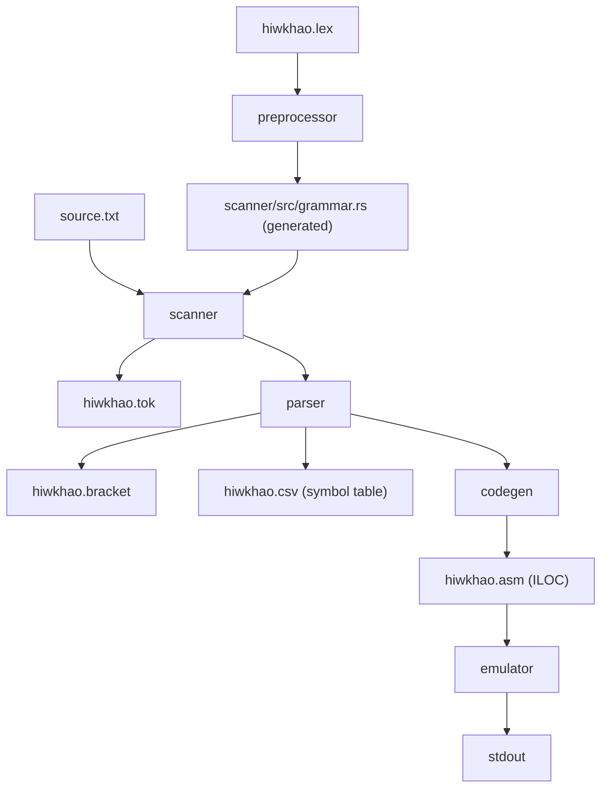

# hiwkhao

> This project was submitted as the final project for the Compiler Construction course in Software Engineering Program.

A full compiler pipeline for the **hiwkhao** language, a simple imperative expression language supporting integers, floats, variables, arithmetic, boolean comparisons, and fixed-size arrays. The compiler is implemented in Rust and targets an **ILOC** (Intermediate Language for Object Code) virtual machine.

---

## Table of Contents

- [Language Overview](#language-overview)
- [Architecture](#architecture)
- [Pipeline Stages](#pipeline-stages)
  - [1. Preprocessor](#1-preprocessor)
  - [2. Scanner](#2-scanner)
  - [3. Parser](#3-parser)
  - [4. Code Generator](#4-code-generator)
  - [5. Emulator](#5-emulator)
- [Token Reference](#token-reference)
- [Grammar](#grammar)
- [ILOC Instruction Set](#iloc-instruction-set)
- [Example End-to-End](#example-end-to-end)
- [Prerequisites](#prerequisites)
- [Building & Running](#building--running)
- [Running Tests](#running-tests)

---

## Language Overview

hiwkhao supports the following constructs:

| Construct | Syntax | Example |
|---|---|---|
| Integer literal | decimal digits | `42` |
| Float literal | decimal with optional exponent | `2.5`, `1.0e-3` |
| Variable assignment | `var = expr` | `x = 5` |
| Arithmetic | `+` `-` `*` `/` | `10 * x`, `2 + 8` |
| Comparison | `==` `!=` `<` `>` `<=` `>=` | `x != 5` |
| Parenthesized expression | `(expr)` | `(2 + 5)` |
| Array declaration | `var = list[N]` | `x = list[10]` |
| Array element read | `var[index]` | `x[0]` |
| Array element write | `var[index] = expr` | `x[0] = 42` |

Each source line is a single statement. The language is untyped at the surface level; values are stored as either 32-bit integers (`i32`) or 64-bit floats (`f64`) in the VM, with separate integer and float ILOC operations emitted based on the syntactic form.

---

## Architecture



The project is a **Cargo workspace** with five member crates plus a root binary:

| Crate | Role |
|---|---|
| `hiwkhao` (root) | Combined pipeline binary: runs scanner → parser → codegen in one step |
| `preprocessor` | Reads `hiwkhao.lex` and generates Rust token definitions |
| `scanner` | Tokenises source text using the generated `logos`-based lexer |
| `parser` | Recursive-descent parser; produces an AST and symbol table |
| `codegen` | Walks the AST and emits three-address ILOC instructions |
| `emulator` | Interprets ILOC instructions on a simple register/memory VM |

---

## Pipeline Stages

### 1. Preprocessor

**Crate:** `preprocessor` · **Entry:** `preprocessor/src/main.rs`

Reads `hiwkhao.lex` (a plain-text file of `TOKEN_NAME  regex` pairs) and generates `scanner/src/grammar.rs`, which contains a `logos`-attributed `Token` enum used by the scanner.

Special rules applied during generation:
- `VAR` receives `priority = 2` so identifiers are matched before any future keyword tokens.
- `WHITESPACE` receives `priority = 1` with a `skip` directive, silently consuming spaces and tabs.

```sh
cargo run -p preprocessor
```

Output: `scanner/src/grammar.rs` (overwritten on every run)

---

### 2. Scanner

**Crate:** `scanner` · **Entry:** `scanner/src/main.rs`

Performs lexical analysis using the [`logos`](https://github.com/maciejhirsz/logos) library for zero-copy, DFA-based tokenisation.

**Public API (`scanner/src/lib.rs`):**

| Function | Description |
|---|---|
| `tokenize(input)` | Returns a raw `logos::Lexer` iterator |
| `tokenize_vector(input)` | Returns `Vec<(lexeme, Token)>` pairs |
| `run_scanner(input)` | Processes input line-by-line; returns formatted token strings |

**Output format** (`hiwkhao.tok`): space-separated `word/TOKEN_TYPE` pairs, one source line per output line.

```
23/INT +/+ 8/INT
x/VAR =/= 5/INT
```

```sh
cargo run -p scanner sample.txt
```

---

### 3. Parser

**Crate:** `parser` · **Entry:** `parser/src/main.rs`

A hand-written **recursive-descent** parser that produces an `Expr` AST and a CSV symbol table.

#### AST (`Expr` enum)

```rust
pub enum Expr {
    Int(i64),
    Float(f64),
    Variable(String),
    BinaryOp(Box<Expr>, String, Box<Expr>),
    Assignment(String, Box<Expr>),
    Boolean(Box<Expr>, String, Box<Expr>),
    List(Vec<f64>),
    ListAccess(String, Box<Expr>),
    UnaryOp(String, Box<Expr>),
}
```

#### Operator Precedence (high → low)

| Level | Operators | Associativity |
|---|---|---|
| 1 | `^` | right |
| 2 | `*` `/` | left |
| 3 | `+` `-` `==` `!=` `<` `>` `<=` `>=` | left (comparisons are non-associative) |
| 4 | unary `-` | prefix |
| 5 | `=` (assignment) | right |

> **Note:** `//` (integer division) is defined as a token but not yet supported in the parser. `^` (power) is parsed but emits an error during code generation.

#### Parse Errors

| Error | Cause |
|---|---|
| `SyntaxError` | Unexpected token |
| `UndefinedVariable` | Variable used before assignment |
| `InvalidAtom` | Unrecognised expression start |
| `IndexOutOfRange` | Array index ≥ declared size |
| `DivisionByZero` | Integer or float division by zero literal |
| `MissingIndex` | Array access without `[index]` |
| `TokenizeError` | Scanner-level failure |

#### Symbol Table (`hiwkhao.csv`)

CSV columns: `Lexeme, Line Number, Start Position, Length, Type, Value`

#### Bracket Output (`hiwkhao.bracket`)

Fully parenthesised expression notation, one expression per line:

```
(23+8)
(x=5)
(x[0]=1)
```

```sh
cargo run -p parser sample.txt
```

---

### 4. Code Generator

**Crate:** `codegen` · **Entry:** `codegen/src/main.rs`

Walks the `Expr` AST and emits **ILOC three-address code** to `hiwkhao.asm`.

#### Register Allocation

Virtual registers `R0, R1, R2, …` are allocated monotonically (no spilling). Memory locations use the `@name` addressing form.

#### Type Dispatch

The emitter inspects both operands and selects the appropriate opcode suffix:
- `.i` - integer operation
- `.f` - float operation

When one operand is an integer and the other is a float, a `FL.i` (int-to-float conversion) instruction is inserted automatically.

#### Array Address Calculation

For `x[i]`, the emitter generates:

```
LD  R_base @x          ; load base address
LD  R_idx  #i          ; load index
LD  R_sz   #4          ; element size (bytes)
MUL.i R_off R_idx R_sz ; byte offset
ADD.i R_addr R_base R_off
```

```sh
cargo run -p codegen sample.txt
```

Output: `hiwkhao.asm`

---

### 5. Emulator

**Crate:** `emulator` · **Entry:** `emulator/src/main.rs`

Interprets `hiwkhao.asm` on a simple VM:

```rust
pub struct VM {
    registers:   HashMap<String, Value>,   // R0, R1, …
    memory:      Vec<u8>,                  // 1 KiB default
    memory_map:  HashMap<String, usize>,   // variable → address
    pc:          usize,
    program:     Vec<String>,
    output:      Vec<String>,
    next_addr:   usize,
}
```

Supported instructions: `LD`, `ST`, `ADD.i/f`, `SUB.i/f`, `MUL.i/f`, `DIV.i/f`, `EQ/NE/LT/GT/LE/GE .i/.f`, `FL.i`, `NEG.i`.

`ST @print Rn` writes the value of `Rn` to standard output.

```sh
cargo run -p emulator hiwkhao.asm
```

---

## Token Reference

| Token | Pattern / Literal |
|---|---|
| `INT` | `-?[0-9]+` |
| `REAL` | `-?[0-9]+\.[0-9]+(e[-+]?[0-9]+)?` |
| `VAR` | `[a-zA-Z_][a-zA-Z0-9_]*` |
| `ADD` | `+` |
| `SUB` | `-` |
| `MUL` | `*` |
| `DIV` | `/` |
| `INTDIV` | `//` |
| `POW` | `^` |
| `EQ` | `==` |
| `NE` | `!=` |
| `LT` | `<` |
| `GT` | `>` |
| `LE` | `<=` |
| `GE` | `>=` |
| `ASSIGN` | `=` |
| `LIST` | `list` |
| `LPAREN` | `(` |
| `RPAREN` | `)` |
| `LBRACKET` | `[` |
| `RBRACKET` | `]` |
| `NEWLINE` | `\r?\n` |
| `WHITESPACE` | `\s+` (skipped) |
| `ERR` | anything unrecognised |

---

## Grammar

Simplified BNF of the hiwkhao grammar:

```
program     ::= statement ( NEWLINE statement )*
statement   ::= assignment | boolean
assignment  ::= VAR ASSIGN expression
             |  VAR LBRACKET expression RBRACKET ASSIGN expression
             |  VAR ASSIGN LIST LBRACKET INT RBRACKET
boolean     ::= SUB? expression ( ( EQ | NE | LT | GT | LE | GE ) expression )?
expression  ::= term ( ( ADD | SUB | EQ | NE | LT | GT | LE | GE ) term )*
term        ::= factor ( ( MUL | DIV ) factor )*
factor      ::= atom ( POW factor )?
atom        ::= INT | REAL | VAR | VAR LBRACKET expression RBRACKET
             |  LPAREN expression RPAREN
             |  LIST LBRACKET INT RBRACKET
```

---

## ILOC Instruction Set

| Instruction | Semantics |
|---|---|
| `LD Rd #imm` | `Rd ← imm` (immediate load) |
| `LD Rd @var` | `Rd ← mem[var]` |
| `LD Rd Rs` | `Rd ← Rs` or `Rd ← mem[Rs]` |
| `ST @var Rs` | `mem[var] ← Rs` |
| `ST @print Rs` | print value of `Rs` |
| `ST Rd Rs` | `mem[Rd] ← Rs` (pointer store) |
| `ADD.i/f Rd Rs1 Rs2` | `Rd ← Rs1 + Rs2` |
| `SUB.i/f Rd Rs1 Rs2` | `Rd ← Rs1 - Rs2` |
| `MUL.i/f Rd Rs1 Rs2` | `Rd ← Rs1 × Rs2` |
| `DIV.i/f Rd Rs1 Rs2` | `Rd ← Rs1 ÷ Rs2` |
| `EQ/NE/LT/GT/LE/GE .i/.f Rd Rs1 Rs2` | `Rd ← Rs1 op Rs2` (0 or 1) |
| `FL.i Rd Rs` | `Rd ← float(Rs)` |
| `NEG.i Rd Rs` | `Rd ← -Rs` (integer) |
| `NEG.f Rd Rs` | `Rd ← -Rs` (float) |

---

## Example End-to-End

**Input (`sample.txt`):**

```
23+8
x=5
10*x
x!=5
x = list[10]
x[0] = 1
x[0] + x[9]
```

**Scanner output (`hiwkhao.tok`):**

```
23/INT +/+ 8/INT
x/VAR =/= 5/INT
10/INT */* x/VAR
x/VAR !=/!= 5/INT
x/VAR =/= list/list [/LBRACKET 10/INT ]/RBRACKET
x/VAR [/LBRACKET 0/INT ]/RBRACKET =/= 1/INT
x/VAR [/LBRACKET 0/INT ]/RBRACKET +/+ x/VAR [/LBRACKET 9/INT ]/RBRACKET
```

**Parser bracket output (`hiwkhao.bracket`):**

```
(23+8)
(x=5)
(10*x)
(x!=5)
(x=list[10])
(x[0]=1)
(x[0]+x[9])
```

**Codegen output (`hiwkhao.asm`, excerpt):**

```
LD R0 #23
LD R1 #8
ADD.i R2 R0 R1
ST @print R2

LD R0 #5
ST @x R0

LD R0 #10
LD R1 @x
MUL.i R2 R0 R1
ST @print R2
```

---

## Prerequisites

- [Rust](https://www.rust-lang.org/tools/install) (edition 2021, stable toolchain)
- Cargo (included with Rust)

---

## Building & Running

**Step 1 - Generate the scanner grammar** (only needed once, or after editing `hiwkhao.lex`):

```sh
cargo run -p preprocessor
```

**Step 2 - Tokenise a source file:**

```sh
cargo run -p scanner sample.txt
# Output: hiwkhao.tok
```

**Step 3 - Parse and build the symbol table:**

```sh
cargo run -p parser sample.txt
# Output: hiwkhao.bracket, hiwkhao.csv
```

**Step 4 - Generate ILOC assembly:**

```sh
cargo run -p codegen sample.txt
# Output: hiwkhao.asm
```

**Step 5 - Execute on the emulator:**

```sh
cargo run -p emulator hiwkhao.asm
```

---

## Running Tests

```sh
cargo test --all
```

The test suite covers arithmetic expressions, boolean comparisons, variable assignments, list declarations, array indexing, division-by-zero detection, and negative number parsing.

---

## Contributors

[@m0owo](https://github.com/m0owo) [@nanananice](https://github.com/nanananic)  [@JRsssssss](https://github.com/JRsssssss) [@zenithdreamer](https://github.com/zenithdreamer)